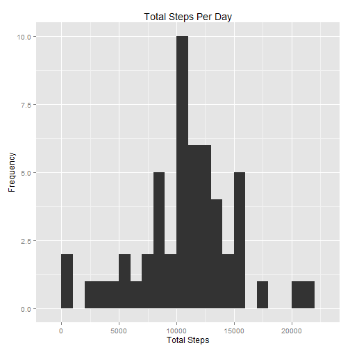
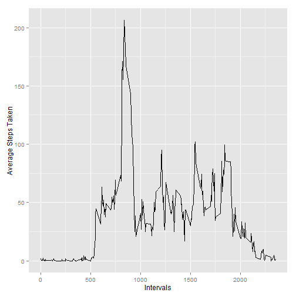
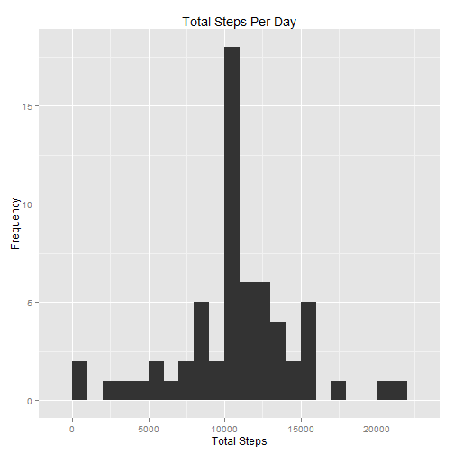
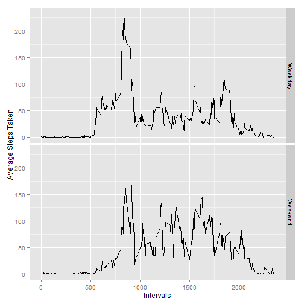

##Loading and preprocessing

1. Downloaded and extracted the Activity Monitoring data on Sun Jun 14 9:03:25 AM 2015 from 
https://d396qusza40orc.cloudfront.net/repdata%2Fdata%2Factivity.zip into a folder 
called RepResearch1 in working directory.

The variables included in this dataset are:

- steps: Number of steps taking in a 5-minute interval (missing values are coded as NA)

- date: The date on which the measurement was taken in YYYY-MM-DD format

- interval: Identifier for the 5-minute interval in which measurement was taken

The dataset is stored in a comma-separated-value (CSV) file and there are a total of 17,568 observations in this dataset.


```r
if(!file.exists("./RepResearch1")){dir.create("./RepResearch1")}
fileUrl <- "http://d396qusza40orc.cloudfront.net/repdata%2Fdata%2Factivity.zip"
download.file(fileUrl,destfile="./RepResearch1/repactivitydata.zip",mode="wb",method="internal")
unzip("./RepResearch1/repactivitydata.zip",exdir="./RepResearch1",overwrite=TRUE,unzip="internal")
```

Read in the csv file to myData


```r
myData <- read.csv("./RepResearch1/activity.csv")
```

##What is mean total number of steps taken per day?

Calculate total number of steps per day and plot histogram.


```r
library(plyr)
library(ggplot2)
completeData <- myData[complete.cases(myData),]
totalsteps <- ddply(completeData,~date,summarise,sum=sum(steps))
qplot(sum,data=totalsteps,
      geom="histogram",
      binwidth=1000,
      main="Total Steps Per Day",
      xlab="Total Steps",
      ylab="Frequency")
```

 

Calculate Mean and Median


```r
summary <- summary(totalsteps)
mean1 <- summary[4,2]
median1 <- summary[3,2]
print(c(mean1,median1))
```

```
## [1] "Mean   :10766  " "Median :10765  "
```

##What is the average daily activity pattern?


```r
activity <- ddply(completeData,~interval,summarise,mean=mean(steps))
qplot(interval,mean,
        data=activity,
        geom="line",
        xlab="Intervals",
        ylab="Average Steps Taken")
```

 

Which interval has the highest average steps taken?


```r
maxsteps <- activity[which(activity$mean==max(activity$mean)),]
print(maxsteps,row.names=F)
```

```
##  interval     mean
##       835 206.1698
```

##Imputing missing values

Number of missing values

```r
sum(is.na(myData))
```

```
## [1] 2304
```

Filling in missing values using the mean steps taken for each interval

```r
##merge data with mean steps taken for each interval from activity data
merged <- merge(myData,activity,by.x="interval")
merged$steps[is.na(merged$steps)] <- merged$mean[is.na(merged$steps)]
adjData <- subset(merged,select=-c(mean))
```

Histogram of na_adjusted data

```r
totalsteps_adj <- ddply(adjData,~date,summarise,sum=sum(steps))
qplot(sum,data=totalsteps_adj,
      geom="histogram",
      binwidth=1000,
      main="Total Steps Per Day",
      xlab="Total Steps",
      ylab="Frequency")
```

 

Revised mean and median for na_adjusted data

```r
summary <- summary(totalsteps_adj)
mean2 <- summary[4,2]
median2 <- summary[3,2]
print(c(mean2,median2))
```

```
## [1] "Mean   :10766  " "Median :10766  "
```

The Median adjusted slightly from Median :10765   to Median :10766  , however the means remained the same at Mean   :10766  .

##Are there differences in activity patterns between weekdays and weekends?

Adding factor (daytype) to identify weekdays and weekends to the adjusted data:

```r
adjData$weekday <- weekdays(as.Date(adjData$date))
adjData$daytype <- as.factor(ifelse(adjData$weekday %in% c("Saturday","Sunday"), "Weekend", "Weekday")) 
```

Activity chart by Weekday or Weekend


```r
activitybytype <- ddply(adjData,daytype~interval,summarise,mean=mean(steps))
qplot(interval,mean,
        data=activitybytype,
        geom="line",
        facets=daytype~.,
        xlab="Intervals",
        ylab="Average Steps Taken")
```

 
